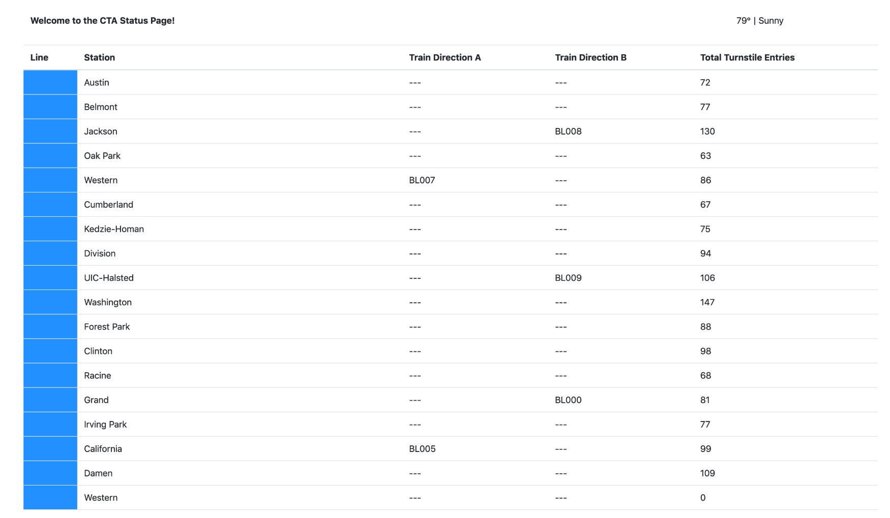
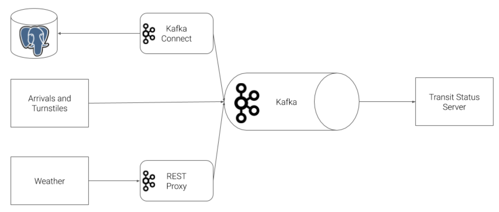

We will construct a streaming event pipeline around Apache Kafka and its ecosystem. Using public data from the Chicago Transit Authority we will construct an event pipeline around Kafka that allows us to simulate and display the status of train lines in real time.

When the project is complete, you will be able to monitor a website to watch trains move from station to station. So a sample static view of the website page you create might look like this: 

**Prerequisites**

You will need the following are required:
Docker
Python 3.7
A minimum of 16gb+ RAM and a 4-core CPU on your computer to execute the simulation
Alternatively, you may complete the project entirely in the Project Workspace we provide.

**Starter Code and Data**
Please find in the Resources tab, in the left sidebar of your classroom here, a zip file with all of the starter files and code referred to here in these directions. You can download those files and run your code locally, or you can use the Project Workspace we provide.

**Directions**

The Chicago Transit Authority (CTA) has asked us to develop a dashboard displaying system status for its commuters. We have decided to use Kafka and ecosystem tools like REST Proxy and Kafka Connect to accomplish this task.

Our architecture will look like so:

**Step 1: Create Kafka Producers**

The first step in our plan is to configure the train stations to emit some of the events that we need. The CTA has placed a sensor on each side of every train station that can be programmed to take an action whenever a train arrives at the station.

To accomplish this, you must complete the following tasks:

1. Complete the code in `producers/models/producer.py.`
2. Define a value schema for the arrival event in `producers/models/schemas/arrival_value.json` with the following attributes: <br\>
    - station_id
    - train_id
    - direction
    - line
    - train_status
    - prev_station_id
    - prev_direction

3. Complete the code in 'producers/models/station.py' so that:
   - A topic is created for each station in Kafka to track the arrival events
   - The station emits an arrival event to Kafka whenever the `Station.run()` function is called.
   - Ensure that events emitted to Kafka are paired with the Avro key and value schemas
4. Define a value schema for the turnstile event in `producers/models/schemas/turnstile_value.json` with the following attributes:
      - station_id
      - station_name
      - line
5. Complete the code in `producers/models/turnstile.py` so that:
- A topic is created for each turnstile for each station in Kafka to track the turnstile events
- The station emits a turnstile event to Kafka whenever the `Turnstile.run()` function is called.
- Events emitted to Kafka are paired with the Avro key and value schemas

**Step 2: Configure Kafka REST Proxy Produce**

Our partners at the CTA have asked that we also send weather readings into Kafka from their weather hardware. Unfortunately, this hardware is old and we cannot use the Python Client Library due to hardware restrictions. Instead, we are going to use HTTP REST to send the data to Kafka from the hardware using Kafka's REST Proxy.

To accomplish this, you must complete the following tasks:

1. Define a value schema for the weather event in `producers/models/schemas/weather_value.json` with the following attributes:
- temperature
- status
2. Complete the code in producers/models/weather.py so that:
- A topic is created for weather events
- The weather model emits weather event to Kafka REST Proxy whenever the Weather.run() function is called.
- Events emitted to REST Proxy are paired with the Avro key and value schemas
- 